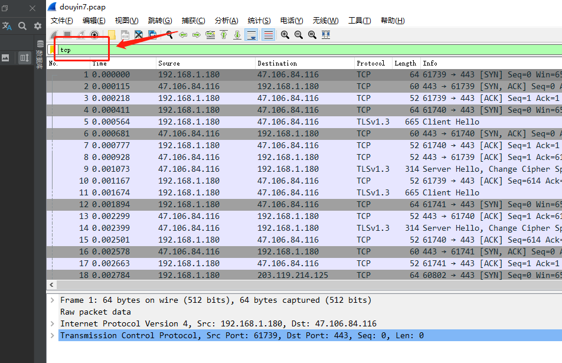
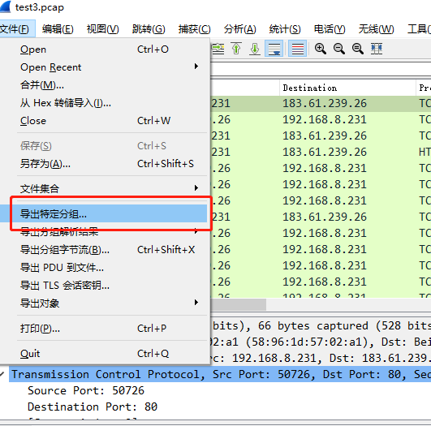

# 功能
- 对wireshark生成的抓包文件进行解析，整合TCP数据部分
- 可用于获取抖音短视频，得到的视频码率为原始码率，并且不带水印
# 原理
- 逐一读取.pcap文件的TCP包，按照源目地址进行归类，将服务端返回的数据排序后写入文件
- 代码内附大量注释，简单易懂。
# 使用教程
- 下载[wireshark](https://www.wireshark.org/download.html) 网上有很多资源跟教程，这里不赘述
- 实现用电脑对手机抓包。这里推荐两种方法（具体操作可以去百度上搜，很多）：
   1. 电脑开热点（猎豹WIFI、360WIFI等），手机连接该热点刷抖音
   2. 下载手机模拟器，用模拟器刷抖音
- 以上步骤准备就绪，就可以开始正常抓包了
  1. 刷几个视频后停止抓包，保存为xx.pcap格式。 
  2. 打开xx.pcap文件，过滤掉非TCP包
     
  3. 选择文件->导出特定分组,保存到项目目录下
     
     
- 项目目录下打开终端，执行 
  ```
  go build
  douyin.exe xx.pcap
  ```
- 项目目录下会生成data文件夹，里面每个文件夹以数据大小命名，文件夹里是.MP4文件，直接打开播放即可  
# 注意
- 该项目为练手项目，主要是为了加深对HTTP、TCP/IP协议的认知
- 抓包过程中如果没有抓全，生成的视频可能打不开或者只能播放一部分时长